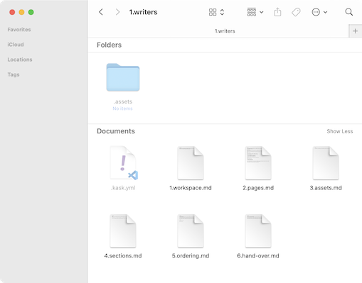

# Assets

To add images to your web pages, move the image files inside the asset folder inside the same directory with the file.



Then add the image path to Markdown file, like:

```md

```

## Image sets

If it is not too complicated and makes sense to do so, create versions of the image for displays with different pixel densities. When correctly done, it will make the images look sharp as the visitor's device support.

If you decide to do so, add each into your asset folder and use directly the image tag as this:

```md

```
