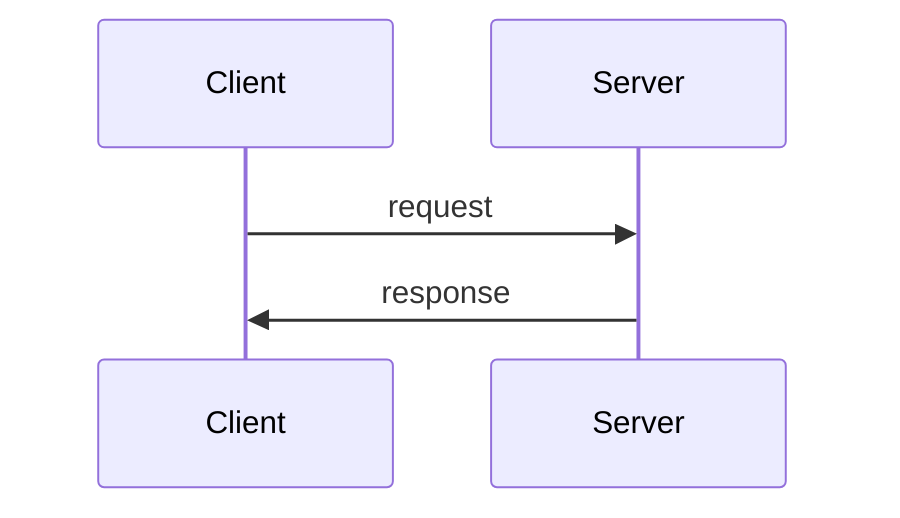

# Download

Elit sit pariatur adipisicing eiusmod excepteur excepteur. Incididunt quis sunt proident dolor esse duis consectetur proident. Sit adipisicing qui pariatur qui excepteur occaecat. Eu id amet duis officia ullamco est sunt sint in mollit cupidatat.

Excepteur pariatur voluptate nisi deserunt incididunt laboris nulla enim deserunt quis qui excepteur Lorem. In aliqua velit cillum cupidatat aliqua minim esse Lorem enim elit occaecat labore ut. Velit duis ad magna culpa eiusmod minim sit. Exercitation incididunt ea quis laboris et fugiat consectetur elit consectetur est laborum qui. Nostrud enim veniam tempor dolore incididunt sint culpa non nisi duis aliqua sint. Nostrud reprehenderit officia duis dolore mollit aliqua tempor sint sit id anim velit. Sint reprehenderit commodo est cillum labore fugiat proident laboris voluptate.

Incididunt adipisicing ipsum labore nostrud anim incididunt consequat incididunt sunt nostrud sunt exercitation in. Ut in minim nisi quis nulla mollit sunt duis exercitation culpa ex do non. Mollit adipisicing irure exercitation occaecat Lorem aliqua adipisicing nostrud enim.


Anim dolore aliqua amet nostrud deserunt. Nostrud ipsum nostrud non consectetur dolor qui consectetur reprehenderit magna sint culpa nisi. Magna nulla in officia laborum mollit irure et mollit sint veniam.

Est dolor minim in laboris minim. Tempor veniam tempor tempor id dolore deserunt quis. Dolor voluptate Lorem cupidatat deserunt voluptate ipsum laborum aliquip cupidatat veniam mollit eu. Dolore ex et elit amet laborum nostrud magna cupidatat excepteur labore qui aliquip. Excepteur pariatur minim eiusmod ipsum. Mollit esse aute ad adipisicing.

## A list

- lorem
- ipsum
  - dolor
  - sit
  - amet
    - consectetur
- adipiscing

## Another list

- another

- day

- another

- slay

- [and a link](..)

```js
class loremipsum {
  loremipsum() {
    this.prepareForFree();
  }

  prepareForFree() {
    this.state = "";
  }

  prepareForReuse() {}

  render() {}
}
```

| Column 1 Header | Column 2 Header   | Column 3 Header |
| --------------- | ----------------- | --------------- |
| Row 1 Cell 1    | Row 1 Cell 2      | Row 1 Cell 3    |
| Row 2 Cell 1    | Row 2 Cell 2      | Row 2 Cell 3    |
| Row 3 Cell 1    | Row 3 Cell 2      | Row 3 Cell 3    |
| Row 1 Cell 1    | Row 1 Cell 2      | Row 1 Cell 3    |
| Row 2 Cell 1    | Row 2 Cell 2      | Row 2 Cell 3    |
| Row 3 Cell 1    | Row 3 Cell 2      | Row 3 Cell 3    |
| Row 1 Cell 1    | Row 1 Cell 2      | Row 1 Cell 3    |
| Row 2 Cell 1    | Row 2 Cell 2      | Row 2 Cell 3    |
| Row 3 Cell 1    | Row 3 Cell 2      | Row 3 Cell 3    |
| Row 1 Cell 1    | Row 1 Cell 2      | Row 1 Cell 3    |
| Row 2 Cell 1    | Row 2 Cell 2      | Row 2 Cell 3    |
| Row 3 Cell 1    | `Row 3`, `Cell 2` | Row 3 Cell 3    |
| Row 1 Cell 1    | Row 1 Cell 2      | Row 1 Cell 3    |
| Row 2 Cell 1    | Row 2 Cell 2      | Row 2 Cell 3    |
| Row 3 Cell 1    | Row 3 Cell 2      | Row 3 Cell 3    |
| Row 1 Cell 1    | Row 1 Cell 2      | Row 1 Cell 3    |
| Row 2 Cell 1    | Row 2 Cell 2      | Row 2 Cell 3    |
| Row 3 Cell 1    | Row 3 Cell 2      | Row 3 Cell 3    |
| Row 1 Cell 1    | Row 1 Cell 2      | Row 1 Cell 3    |
| Row 2 Cell 1    | Row 2 Cell 2      | Row 2 Cell 3    |
| Row 3 Cell 1    | Row 3 Cell 2      | Row 3 Cell 3    |

```go
package main

import (
	"fmt"
	"os"

	"github.com/gomarkdown/markdown"
	"github.com/gomarkdown/markdown/ast"
	"github.com/gomarkdown/markdown/html"
	"github.com/gomarkdown/markdown/parser"
)

var mds = `# header

Sample text.

[link](http://example.com)
`

func mdToHTML(md []byte) []byte {
	// create markdown parser with extensions
	extensions := parser.CommonExtensions | parser.AutoHeadingIDs | parser.NoEmptyLineBeforeBlock
	p := parser.NewWithExtensions(extensions)
	doc := p.Parse(md)

	// create HTML renderer with extensions
	htmlFlags := html.CommonFlags | html.HrefTargetBlank
	opts := html.RendererOptions{Flags: htmlFlags}
	renderer := html.NewRenderer(opts)

	return markdown.Render(doc, renderer)
}

func main() {
	md := []byte(mds)
	html := mdToHTML(md)

	fmt.Printf("--- Markdown:\n%s\n\n--- HTML:\n%s\n", md, html)
}
```

## Lorem ipsum dolor sit amet

### Consectetur

1. Lorem ipsum.
1. Dolor sit amet.
1. Consectetur adipiscing elit.
   1. Fusce vel posuare enim.
   1. Nam vulputate lectus ligula.
1. Vitae maximus mi bibendum ac.
1. Irure magna in ullamco veniam laborum amet proident cupidatat nostrud.
1. Voluptate consectetur proident anim non aute nulla non aute exercitation commodo ut velit consectetur nulla.
1. Id voluptate enim sunt pariatur in velit sit qui anim deserunt ullamco in.
1. Ex velit tempor est elit laboris non id quis commodo velit exercitation culpa sit ea.
   ```sh
   cd bin
   ```
1. Aliquip ut voluptate deserunt incididunt mollit est enim.
1. Id do officia in exercitation laboris sunt laborum.
1. Lorem commodo minim occaecat amet dolor non deserunt mollit adipisicing exercitation cillum cupidatat fugiat.
1. Qui id aliqua quis nulla quis ad laboris laboris labore aliqua ipsum cillum sunt minim.



### Adipiscing

````go
package main

// example for https://blog.kowalczyk.info/article/cxn3/advanced-markdown-processing-in-go.html

import (
	"fmt"
	"io"

	"github.com/gomarkdown/markdown"
	"github.com/gomarkdown/markdown/ast"
	mdhtml "github.com/gomarkdown/markdown/html"

	"github.com/alecthomas/chroma"
	"github.com/alecthomas/chroma/formatters/html"
	"github.com/alecthomas/chroma/lexers"
	"github.com/alecthomas/chroma/styles"
)

var (
	htmlFormatter  *html.Formatter
	highlightStyle *chroma.Style
)

func init() {
	htmlFormatter = html.New(html.WithClasses(true), html.TabWidth(2))
	if htmlFormatter == nil {
		panic("couldn't create html formatter")
	}
	styleName := "monokailight"
	highlightStyle = styles.Get(styleName)
	if highlightStyle == nil {
		panic(fmt.Sprintf("didn't find style '%s'", styleName))
	}
}

// based on https://github.com/alecthomas/chroma/blob/master/quick/quick.go
func htmlHighlight(w io.Writer, source, lang, defaultLang string) error {
	if lang == "" {
		lang = defaultLang
	}
	l := lexers.Get(lang)
	if l == nil {
		l = lexers.Analyse(source)
	}
	if l == nil {
		l = lexers.Fallback
	}
	l = chroma.Coalesce(l)

	it, err := l.Tokenise(nil, source)
	if err != nil {
		return err
	}
	return htmlFormatter.Format(w, highlightStyle, it)
}

// an actual rendering of Paragraph is more complicated
func renderCode(w io.Writer, codeBlock *ast.CodeBlock, entering bool) {
	defaultLang := ""
	lang := string(codeBlock.Info)
	htmlHighlight(w, string(codeBlock.Literal), lang, defaultLang)
}

func myRenderHook(w io.Writer, node ast.Node, entering bool) (ast.WalkStatus, bool) {
	if code, ok := node.(*ast.CodeBlock); ok {
		renderCode(w, code, entering)
		return ast.GoToNext, true
	}
	return ast.GoToNext, false
}

func newCustomizedRender() *mdhtml.Renderer {
	opts := mdhtml.RendererOptions{
		Flags:          mdhtml.CommonFlags,
		RenderNodeHook: myRenderHook,
	}
	return mdhtml.NewRenderer(opts)
}

var mds = "code block:\n```go\nvar n = 384\n```"

func codeHighlight() {
	md := []byte(mds)

	renderer := newCustomizedRender()
	html := markdown.ToHTML(md, nil, renderer)

	fmt.Printf("--- Markdown:\n%s\n\n--- HTML:\n%s\n", md, html)
}

func main() {
	codeHighlight()
}
````

```ts
/**
 * Sorts all the `words` in the cSpell.json file.
 *
 * Run from the same folder as the `cSpell.json` file
 * (i.e. the root of the Mermaid project).
 */

import { readFileSync, writeFileSync } from "node:fs";
import prettier from "prettier";

const filepath = "./cSpell.json";
const cSpell: { words: string[] } = JSON.parse(readFileSync(filepath, "utf8"));

cSpell.words = [...new Set(cSpell.words.map((word) => word.toLowerCase()))];
cSpell.words.sort((a, b) => a.localeCompare(b));

const prettierConfig = prettier.resolveConfig.sync(filepath) ?? {};
writeFileSync(
  filepath,
  prettier.format(JSON.stringify(cSpell), {
    ...prettierConfig,
    filepath,
  })
);
```

$$
\left[ \begin{array}{a} a^l_1 \\ ⋮ \\ a^l_{d_l} \end{array}\right]
= \sigma(
 \left[ \begin{matrix}
 	w^l_{1,1} & ⋯  & w^l_{1,d_{l-1}} \\
 	⋮ & ⋱  & ⋮  \\
 	w^l_{d_l,1} & ⋯  & w^l_{d_l,d_{l-1}} \\
 \end{matrix}\right]  ·
 \left[ \begin{array}{x} a^{l-1}_1 \\ ⋮ \\ ⋮ \\ a^{l-1}_{d_{l-1}} \end{array}\right] +
 \left[ \begin{array}{b} b^l_1 \\ ⋮ \\ b^l_{d_l} \end{array}\right])
$$
